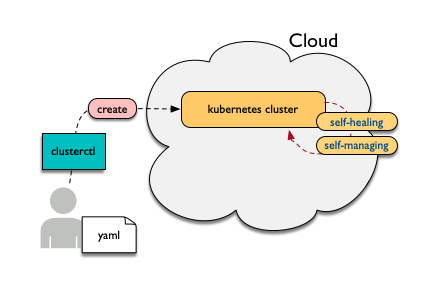
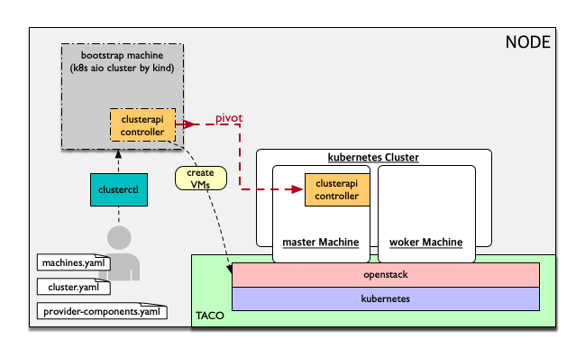

*********************
Cluster API Hands-on
*********************

Cluster API 란?
========================

Cluster API는 cloud(or baremetal)에 kubernetes 스타일로 정의된 api로 kubernetes cluster를 생성/설정/관리하는 기능이다.
사용자는 설치에 필요한 몇몇 yaml파일을 clusterctl 명령어를 이용해서 배포하면 target cloud에 auto-healing, auto-managing되는 kubernetes cluster를 손쉽게 생성할 수 있다.

::

   See also:
   cluster-api-provider-openstack: https://github.com/kubernetes-sigs/cluster-api-provider-openstack
   Kind: https://github.com/kubernetes-sigs/kind

Cluster API Hands-on 구조
==========================

Hands-on 후 알게 되는 내용
===========================

CRD (Custom Resource Definition)
---------------------------------

  Custom resources can appear and disappear in a running cluster through dynamic registration, and cluster admins can update custom resources independently of the cluster itself. Once a custom resource is installed, users can create and access its objects using kubectl, just as they do for built-in resources like Pods.

Controller Pattern
-------------------

  In applications of robotics and automation, a control loop is a non-terminating loop that regulates the state of the system. In Kubernetes, a controller is a control loop that watches the shared state of the cluster through the API server and makes changes attempting to move the current state towards the desired state. Examples of controllers that ship with Kubernetes today are the replication controller, endpoints controller, namespace controller, and serviceaccounts controller.

----------------

00-clone-scripts
==================

clusterapi-scripts를 clone 받는다.

.. code-block:: bash

   $ git clone https://github.com/openinfradev/openinfraday-2019-clusterapi-scripts.git
   $ cd openinfraday-2019-clusterapi-scripts

이후에는 ``./01-install-tools.sh`` 와 같이 scripts를 하나씩 실행하면 된다.

01-install-tools
==================

go, yq, clusterctl 등 필요한 tool들을 설치한다.

go install
----------

binary file을 받아 go를 설치하고, PATH 및 GOPATH 설정을 한다.

binary file 다운 및 압축 해제
 
.. code-block:: bash

   $ wget https://dl.google.com/go/go1.12.7.linux-amd64.tar.gz
   $ tar -C /usr/local -xzf go1.12.7.linux-amd64.tar.gz
   $ rm -f ./go1.12.7.linux-amd64.tar.gz

bashrc에 다음 두 줄을 추가한다.

.. code-block:: yaml

   $ cat >> ~/.bashrc <<EOF
   export PATH=$PATH:/usr/local/go/bin:/root/go/bin
   export GOPATH=$HOME/go
   EOF

.. code-block:: bash

   $ source ~/.bashrc

yq install
----------

.. code-block:: bash

   $ go get gopkg.in/mikefarah/yq.v2
   $ mv ~/go/bin/yq.v2 /usr/local/bin/yq

clusterctl install
------------------

Open source로부터 git clone을 받고, clusterctl binary 파일을 생성한다.

.. code-block:: bash

   $ git clone -b taco-clusterapi https://github.com/openinfradev/cluster-api-provider-openstack.git $GOPATH/src/sigs.k8s.io/cluster-api-provider-openstack
   $ cd $GOPATH/src/sigs.k8s.io/cluster-api-provider-openstack/
   $ make clusterctl
   $ rm -rf ~/go/bin/clusterctl
   $ cp -f $GOPATH/src/sigs.k8s.io/cluster-api-provider-openstack/bin/clusterctl ~/go/bin/

bootstraping machine tool 설치 (kind)
-------------------------------------

kind(kubernetes in docker)를 설치한다.
kind 는 bootstraping machine으로, 처음에 custom resource를 정의하고 생성하는 역할을 한다.

.. code-block:: bash

   $ cd ~/
   $ GO111MODULE="on" go get sigs.k8s.io/kind@v0.4.0

02-prepare-openstack-resource
===============================

필요한 Openstack Resource들을 준비한다.
vm에 적용할 security group을 만들고, CentOS image를 업로드하고, vm에 부여할 floating ip를 만든다.

security group
--------------

openstack client 를 통해서 security group(보안그룹)을 정의한다.
security group을 통해 만들어진 vm으로 들어오고 나가는 트래픽을 세부적으로 제어할 수 있다.

.. code-block:: bash

   openstack security group create clusterapi
   openstack security group rule create --ingress --protocol tcp --dst-port 6443 clusterapi
   openstack security group rule create --ingress --protocol tcp --dst-port 22 clusterapi
   openstack security group rule create --ingress --protocol tcp --dst-port 179 clusterapi
   openstack security group rule create --ingress --protocol tcp --dst-port 3000:32767 clusterapi
   openstack security group rule create --ingress --protocol tcp --dst-port 443 clusterapi
   openstack security group rule create --egress clusterapi

CentOS image upload
-------------------

CensOS 이미지를 다운받고, 이를 openstack에 업로드한다.
이 CentOS-7-1905 이미지로 master vm와 worker vm을 만들 것이다.

.. code-block:: bash

   cd ~/
   wget https://cloud.centos.org/centos/7/images/CentOS-7-x86_64-GenericCloud-1905.qcow2
   openstack image create 'CentOS-7-1905' --disk-format qcow2 --file ~/CentOS-7-x86_64-GenericCloud-1905.qcow2 --container-format bare --public
   rm -f CentOS-7-x86_64-GenericCloud-1905.qcow2

Floating ip 2개 생성
--------------------

master vm과 worker vm에 부여할 2개의 floating ip 를 미리 생성한다.
여기서 생성한 floating ip 를 통해 host와 vm이 통신하게 된다.

.. code-block:: bash

   $ openstack floating ip create public-net
   $ openstack floating ip create public-net

03-prepare-clusterctl
======================

clusterctl 실행하기에 앞선 준비작업을 한다.

create ~/clouds.yaml
--------------------

clusterctl로 배포할 환경의 정보를 입력한다.
이 Hands-on에서는 openstack으로 cluster를 배포한다.
따라서, TACO로 구축한 openstack에 대한 정보를 clouds.yaml로 만들고
파일을 kind에 넘겨주면, kind는 이를 바탕으로 openstack client와 통신하며 cluster를 배포한다.

아래의 결과로 얻은 openstack의 admin project ID를 clouds.yaml에 넣어준다.

.. code-block:: bash

   $ openstack project list | grep admin | awk '{print $2}'

.. code-block:: yaml
   :Caption: ~/clouds.yaml

   PROJECT_ID=$(openstack project list | grep admin | awk '{print $2}')
   
   cat > ~/clouds.yaml <<EOF
   clouds:
     taco-openstack:
       auth:
         auth_url: http://keystone.openstack.svc.cluster.local:80/v3
         project_name: admin
         username: admin
         password: password
         user_domain_name: Default
         project_domain_name: Default
         project_id: ${PROJECT_ID}
       region_name: RegionOne
   EOF

user-data에 hosts 수정 코드 삽입
--------------------------------

맨 위의 그림에서 볼 수 있듯이, clusterapi-controller가 kubernetess cluster로 pivot 된 이후
kubernetes cluster에서 openstack api와 통신하면서 cluster의 상태를 확인한다.

이 작업은 cluster에서 openstack api에 접근할 수 있도록 host 정보를 알려주는 과정이다.
master와 worker의 user-data.sh 파일에서 YOUR-NODE-IP를 자신의 **host** ip로 바꿔준다.

.. code-block:: bash

   $ IP=$(ifconfig bond0 | grep netmask | awk '{print $2}')
   
   $ cd $GOPATH/src/sigs.k8s.io/cluster-api-provider-openstack/cmd/clusterctl/examples/openstack/provider-component/user-data/centos/templates

   $ sed -i "s/YOUR-NODE-IP/${IP}/g" master-user-data.sh
   $ sed -i "s/YOUR-NODE-IP/${IP}/g" worker-user-data.sh

YAML 생성
---------

generate-yaml.sh을 통해 cluster와 machine에 대한 yaml 파일을 생성한다.
여기는 template만 만드는 과정이고, 후에 배포할 환경에 맞추어 변수들을 바꿔줄 것이다.

.. code-block:: bash

   $ cd $GOPATH/src/sigs.k8s.io/cluster-api-provider-openstack/cmd/clusterctl/examples/openstack
   $ rm -rf out
   $ ./generate-yaml.sh -f ~/clouds.yaml taco-openstack centos
   $ ls out/
   cluster.yaml machines.yaml provider-components.yaml

Openstack keypair 등록
----------------------

vm에 넣을 keypair를 만들고 openstack에 등록한다.

.. code-block:: bash

   $ openstack keypair create --public-key ~/.ssh/openstack_tmp.pub cluster-api-provider-openstack

machines.yaml 수정
------------------

배포할 환경에 맞게 machines.yaml 파일을 수정한다.

1. image, username, network, securitygroup 설정

   * **image**: vm이 사용할 image를 설정한다. 앞에서 등록한 CentOS-7-1905 사용.
   * **username**: vm으로 ssh 접속할 때 username을 설정한다. CensOS 기본 username 사용.
   * **network**: vm이 사용할 네트워크를 설정한다.(private-net 사용)
   * **securitygroup**: vm에 적용할 보안그룹 정책을 설정한다. 앞에서 설정한 clusterapi 사용.

.. code-block:: bash

   $ NETWORK_UUID=$(openstack network list | grep private-net | awk '{print $2}')
   $ SECURITY_GROUP=$(openstack security group list | grep clusterapi | awk '{print $2}')
   $ sed -i "s/<Image Name>/CentOS-7-1905/g" out/machines.yaml
   $ sed -i "s/<SSH Username>/centos/g" out/machines.yaml
   $ sed -i "s/<Kubernetes Network ID>/${NETWORK_UUID}/g" out/machines.yaml
   $ sed -i "s/<Security Group ID>/${SECURITY_GROUP}/g" out/machines.yaml
   $ sed -i "s/1.14.0/1.14.3/g" out/machines.yaml

2. floating ip 설정

   * 사용되고 있지 않은 floating ip를 조회하여, master와 worker에 각각 하나씩 부여한다.

.. code-block:: bash

   $ FLOATING_IP_1=$(openstack floating ip list | grep None | head -n 1 | awk '{print $4}')
   $ FLOATING_IP_2=$(openstack floating ip list | grep None | head -n 2 | tail -n 1 | awk '{print $4}')
   $ FLOATING_IP_LINENUM_1=$(cat out/machines.yaml | grep -n floatingIP | awk '{print $1}' | tr -d ':' | head -n 1)
   $ FLOATING_IP_LINENUM_2=$(cat out/machines.yaml | grep -n floatingIP | awk '{print $1}' | tr -d ':' | tail -n 1)
   $ sed -i "${FLOATING_IP_LINENUM_1}s/<Available Floating IP>/${FLOATING_IP_1}/" out/machines.yaml
   $ sed -i "${FLOATING_IP_LINENUM_2}s/<Available Floating IP>/${FLOATING_IP_2}/" out/machines.yaml

3. tags, serverMeta 등 불필요한 내용 삭제

   * tags와 serverMeta에 대한 내용을 삭제한다.

.. code-block:: bash

   $ TAGS_LINENUM_1=$(cat out/machines.yaml | grep -n tags | awk '{print $1}' | tr -d ':' | head -n 1)
   $ if [[ ! -z "$TAGS_LINENUM_1" ]]; then
     sed -i "${TAGS_LINENUM_1},$(($TAGS_LINENUM_1+3))d" out/machines.yaml
   fi
   $ TAGS_LINENUM_2=$(cat out/machines.yaml | grep -n tags | awk '{print $1}' | tr -d ':' | tail -n 1)
   if [[ ! -z "$TAGS_LINENUM_2" ]]; then
     sed -i "${TAGS_LINENUM_2},$(($TAGS_LINENUM_2+3))d" out/machines.yaml
   fi

4. home directory로 복사

   * 설정이 완료된 yaml 파일을 홈으로 복사한다.

.. code-block:: bash

   $ cp -f out/cluster.yaml ~/
   $ cp -f out/machines.yaml ~/
   $ cp -f out/provider-components.yaml ~/

04-make-cluster
================

clusterctl 로 cluster를 생성한다.

create k8s cluster on openstack
-------------------------------

*clusterctl이 실행되는 동안 멈추지 말고 기다려야 한다.*

.. code-block:: bash

   $ clusterctl create cluster --bootstrap-type kind --provider openstack -c ~/cluster.yaml -m ~/machines.yaml -p ~/provider-components.yaml

Useful Commands
----------------

* 140-get-kind-cluster.sh: kind에 생성된 pod를 모두 조회한다.
* 141-get-nodes.sh: clsterctl이 끝난 후 구축된 k8s cluster의 node를 조회한다.
* 142-logs-kind-controller.sh: clusterctl이 실행될 때 kind의 clusterapi-controller log를 확인한다.
* 143-check-user-data-vm.sh: 생성된 master vm의 user-data 파일을 확인한다. YOUR-NODE-IP가 host의 ip로 잘 바뀌었는지 확인한다.
* 144-logs-cloud-init-vm.sh: master vm이 생성되고 init되는 과정의 log를 확인한다.
* 145-logs-k8s-install-vm.sh: init 이후, vm에 k8s가 구축되는 과정의 log를 확인한다.
* 146-delete-kind.sh: kind cluster와 생성된 master 및 worker vm을 삭제한다. clusterctl 도중 문제가 발생했을 경우 이 script를 실행하고 03 script	부터 다시 실행하여 새로운 cluster를 구축한다.

05-check-pivot
===============

clsuterctl 이 종료된 후, kind에 있던 clusterapi-controller가 kubernetes cluster 내부로 pivot 되었는지 확인한다.

master vm으로 ssh 접속하여 k8s namespace를 확인한다.
openstack-provider-system namespace의 clusterapi-controller pod를 확인한다.

.. code-block:: bash

   $ MASTER_VM_IP=$(openstack server list | grep master | awk '{print $9}')
   $ ssh -i ~/.ssh/openstack_tmp centos@${MASTER_VM_IP} -t "sudo kubectl get namespaces"
   $ ssh -i ~/.ssh/openstack_tmp centos@${MASTER_VM_IP} -t "sudo kubectl get pods -n openstack-provider-system"

06-check-clusterapi
====================

cluster가 clusterapi-controller를 통해서 self-healing & self-management가 되고 있는지 확인한다.

worker vm을 삭제하고 다시 생성되는지 테스트한다.

.. code-block:: bash

   $ WORKER=$(openstack server list | grep node | awk '{print $4}')
   $ openstack server delete ${WORKER}

worker vm을 삭제했을 때, clusterapi-controller의 log를 확인한다.

.. code-block:: bash

   $ MASTER_VM_IP=$(openstack server list | grep master | awk '{print $9}')
   $ ssh -i ~/.ssh/openstack_tmp centos@${MASTER_VM_IP} -t "sudo kubectl logs -f clusterapi-controllers-0 -n openstack-provider-system"

