**********************
TACO install - aio node
***********************

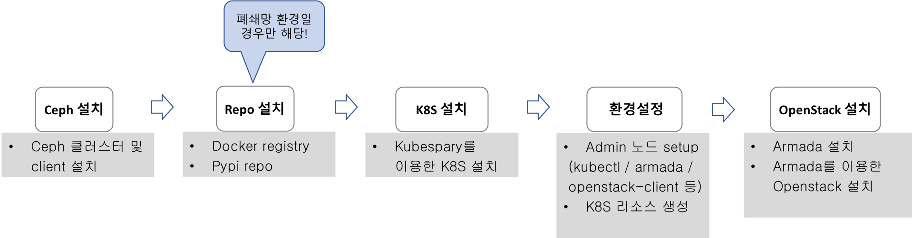

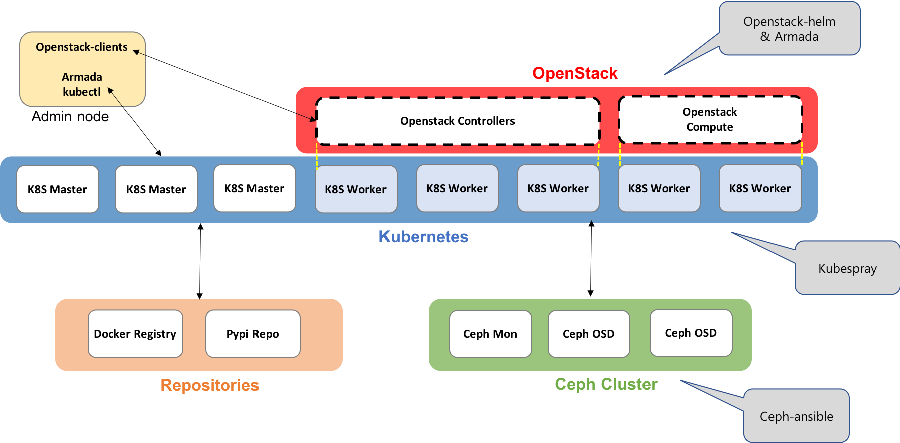

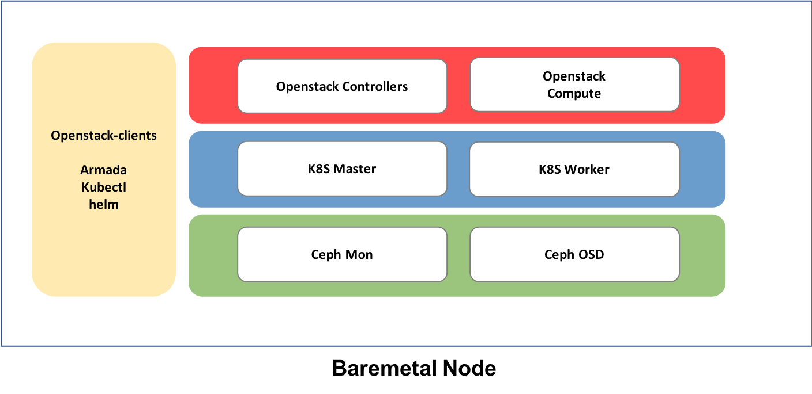

|

Machine 접속방법
================

root 계정으로 자신의 머신에 접속한 후 etherpad 에 공유해 놓은 비밀번호를 입력한다. 

.. code-block:: bash
   
   #MACHINE_IP에 배정받은 가상머신의 ip주소를 적는다.
   $ ssh root@MACHINE_IP

tacoplay 설정
=============

Tacoplay 받아서 준비하기
------------------------

.. code-block:: bash

   $ sudo yum install -y git selinux-policy-targeted bridge-utils epel-release
   $ sudo yum install -y python-pip
   $ sudo pip install --upgrade pip==9.0.3
   $ git clone https://github.com/openinfradev/tacoplay.git
   $ cd tacoplay/
   $ ./scripts/prepare.sh ~/tacoplay/inventory/sample/armada-manifest.yaml   

|

하위 프로젝트들 fetch
---------------------

* armada :  armada 설치에 필요한 소스
* ceph-ansible : ceph 설치에 사용되는 ansible playbook
* kubespray : kubernetes 설치에 사용되는 ansible playbook
* charts : kubernetes위에 openstack을 배포하는 데 필요한 helm chart  

.. code-block:: bash

   $ ./fetch-sub-projects.sh
   
|

ceph-ansible site.yml 생성
--------------------------

.. code-block:: bash

   $ cp ceph-ansible/site.yml.sample ceph-ansible/site.yml

|

설정 파일 설명 
--------------

인벤토리를 구성할 때 필요한 세 가지 설정파일들(위치:~/tacoplay/inventory/sample/) 

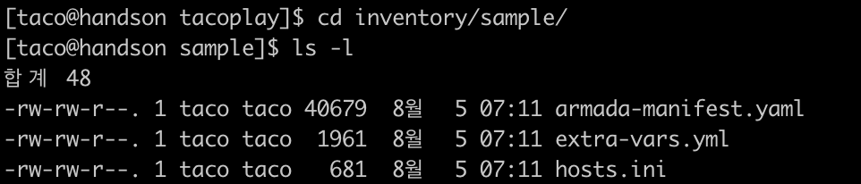

|
   
hosts.ini 파일 설명
-------------------

taco 클러스터를 구성하는 노드들을 역할에 맞게 정의한다.

* ex) 노드 3대를 사용할 경우

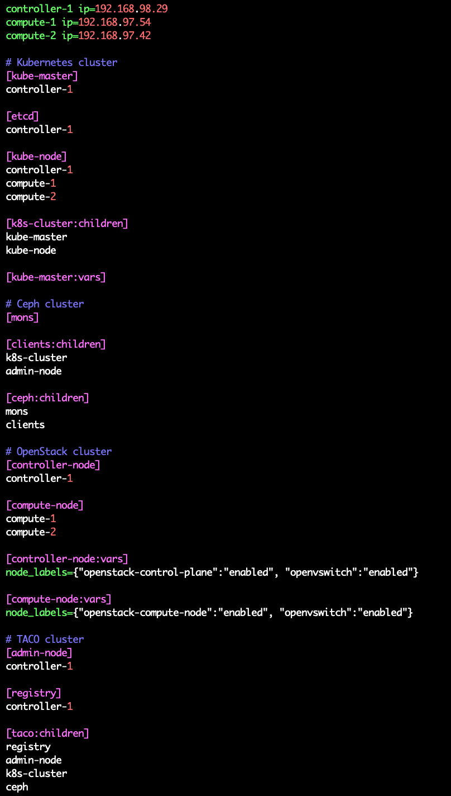

|

* 노드 1대를 사용할 경우

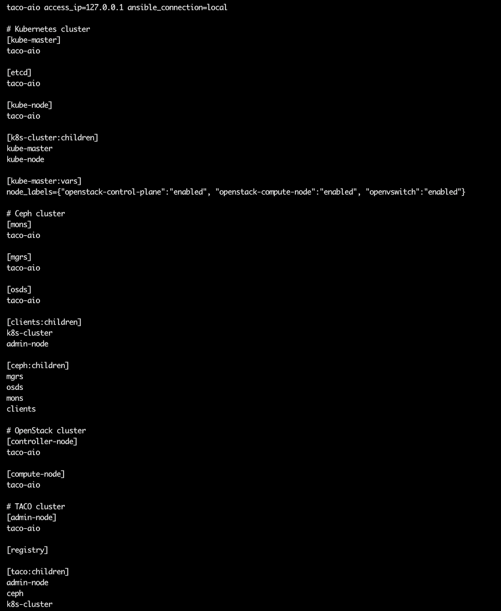

|

extra-vars.yml 파일 수정 
------------------------

ansible-playbook 실행 시 필요한 변수 값을 재정의한다.
 

* lsblk 명령어를 통해 ceph에서 사용할 수 있는 디스크를 확인한다. 
* 아무것도 mount되어있지 않은 디스크 중에서 용량이 가장 큰 2가지를 선택한다.

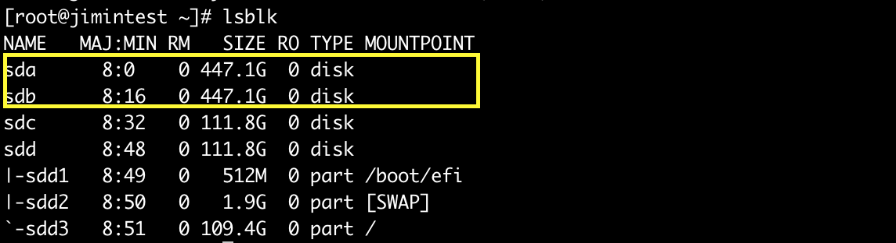

|

* host의 ip주소를 확인한다.

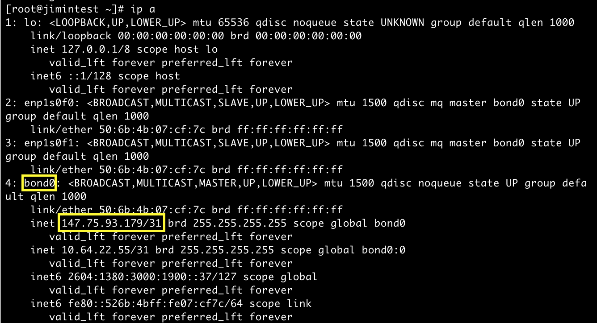

|

* 위에서 확인한 값들로 extra-vars.yml 파일의 다음 값들을 수정한다.

  * monitor_interface: bond0 확인
  * public_network & cluster_network: 호스트의 네트워크 대역 입력
  * lvm_molumes를 변경: ceph용 디스크명 입력

.. code-block:: bash

   $ cd ~/tacoplay/inventory/sample
   $ vi extra-vars.yml

.. figure:: _static/cidr.png

|
|

* armada-manifest.yaml 수정

예시 파일로 주어진 armada-manifest.yaml에서는 모든 차트의 source 디렉토리 위치
가 ``/home/centos/tacoplay/...`` 로 되어있다.

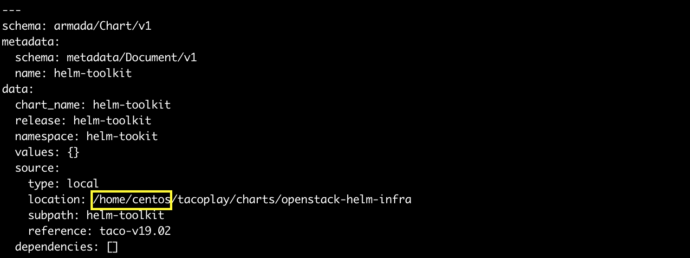

이를 자신의 환경에 tacoplay가 설치되어 있는 경로로 수정 한다. 
현재 실습 환경에서는 tacoplay는 /root 디렉토리 밑에 설치되어 있으므로 아래와 같은 sed명령어를 통해 변경할 수 있다. 

.. code-block:: bash

   $ cd ~/tacoplay
   $ sed -i "s#/home/centos#/root#g" inventory/sample/armada-manifest.yaml

|
|

OS 설정
=======

호스트 파일 설정
----------------

/etc/hosts 파일을 열고 127.0.0.1에 "taco-aio"를 추가해준다. 

.. code-block:: bash

   $ sudo vi /etc/hosts
   ## TACO ClusterInfo
   127.0.0.1 taco-aio localhost localhost.localdomain localhost4 localhost4.localdomain4

|
|  

TACO 설치
=========

TACO playbook 실행에 필요한 패키지 설치 
---------------------------------------

아래 코드는 순서를 지켜서 실행해야함.

.. code-block:: bash

   cd ~/tacoplay
   sudo pip install -r ceph-ansible/requirements.txt
   sudo pip install -r kubespray/requirements.txt --upgrade
   sudo pip install -r requirements.txt --upgrade

|
  

Taco 설치
---------

.. code-block:: bash

   $ cd ~/tacoplay
   $ ansible-playbook -b -i inventory/sample/hosts.ini -e @inventory/sample/extra-vars.yml site.yml
   

ansible-playbook 옵션 설명 

* -i : 사용할 inventory 파일 지정
* -e : 실행시간에 변수 값 전달

|
|

TACO 설치 확인
==============

Pod 상태 확인
--------------

.. code-block:: bash
   
   $ kubectl get pods -n openstack   <- pod 상태 확인
   $ watch 'kubectl get pods -n openstack'   <- watch 명령어를 통해 pod의 상태를 실시간으로 확인
   $ watch 'kubectl get pods -n openstack | grep -v Com'   <- Completed 된 상태의 pod를 제외하고 실시간으로 확인

  
다음 사진과 같이 pod가 다 뜨게 되면 taco 설치가 완료된 것이다. (kubectl get pods -n openstack | grep -v Com 실행결과)

.. figure:: _static/getpod.png

|

Horizon 접속
------------
 
Openstack dashboard인 Horizon에 접속해본다.

* http://HOST_IP:31000    <- 배정받은 machine의 ip를 넣어준다.

.. figure:: _static/horizon.png

계정정보

* domain : default
* id : admin
* pw : password

|

Network 설정
------------
Script를 통해 Openstack에서 사용할 bridge 및 IP masquerading을 위한 iptables rule 추가 등의 작업을 수행한다.

.. code-block:: bash
   
   $ cd ~/tacoplay
   $ ./scripts/init-network.sh

|

Openstack 설치 검증
-------------------

.. code-block:: bash

   $ cd ~/tacoplay
   $ scripts/taco-test.sh
   

위의 script를 수행하면 다음과 같은 task들을 수행하여 Openstack이 정상 동작하는지 검증하게 된다.

* (가상) Network 및 Router 생성
* Cirros Image upload
* SecurityGroup 생성
* Keypair Import
* VM 생성 후 floating IP 추가
* Volume 생성 후 VM에 추가

|
|

VM 생성 후
==========

생성된 VM 확인하기
------------------

다음 명령어를 통해 taco-test 스크립트를 돌려 생성된 VM을 확인할 수 있다. 결과 Networks 란에서 생성된 VM 의 floating IP 주소를 확인한다.

.. code-block:: bash

   $ . tacoplay/scripts/adminrc
   $ openstack server list
 
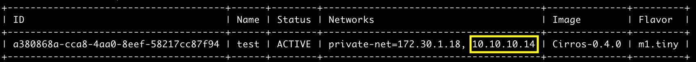

|

생성된 VM에 접속, 외부 통신 확인
--------------------------------

ssh로 VM 에 접속 후, 네트워크 접속 상태를 확인하기 위해 ping 테스트를 수행한다. 

.. code-block:: bash

   [root@taco-aio ~]# ssh cirros@10.10.10.14    (<- 생성된 VM의 ip주소를 넣는다.)

   # VM 내부에서 수행
   $ ping 8.8.8.8
   PING 8.8.8.8 (8.8.8.8): 56 data bytes
   64 bytes from 8.8.8.8: seq=0 ttl=53 time=1.638 ms
   64 bytes from 8.8.8.8: seq=1 ttl=53 time=1.498 ms
   64 bytes from 8.8.8.8: seq=2 ttl=53 time=1.147 ms
   64 bytes from 8.8.8.8: seq=3 ttl=53 time=1.135 ms
   64 bytes from 8.8.8.8: seq=4 ttl=53 time=1.237 ms

|
|

K8S pod test
============

Scale-Out 테스트
----------------

Deployment 설정을 수정하여 간단히 pod의 수를 조절할 수 있다.

cinder-api의 replicas를 2개로 증가시켜 본다. 

.. code-block:: bash
   
   $ kubectl edit deploy cinder-api -n openstack

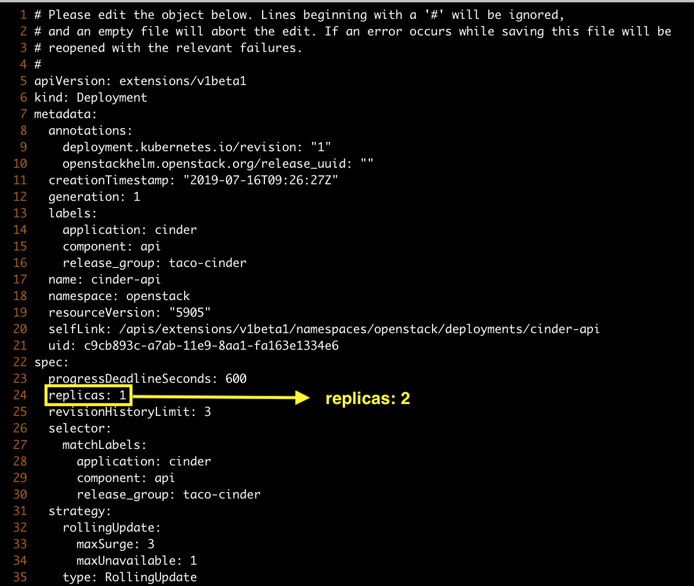

|

cinder-api pod의 수가 2개로 늘어나는 것을 확인할 수 있다. 

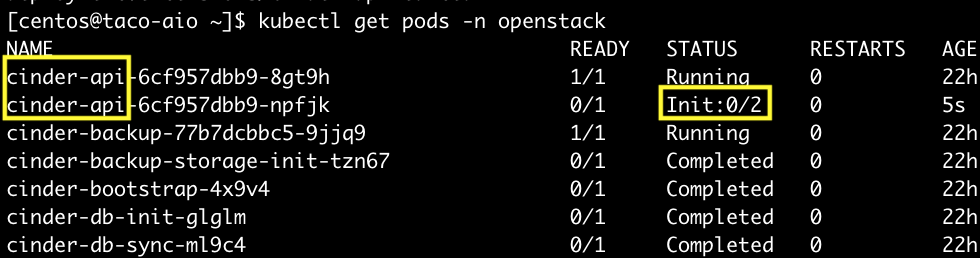

|

Self-Healing 테스트
-------------------

pod를 삭제시켜도 다시 복구 되는 것을 확인해본다.

.. code-block:: bash

   $ kubectl delete pod -n openstack cinder-api-6cf957dbb9-8gt9h  
   > pod "cinder-api-6cf957dbb9-8gt9h" deleted

   $ kubectl get pod -n openstack 

|

cinder-api pod가 새로 생성되고 있는 것을 확인할 수 있다. 

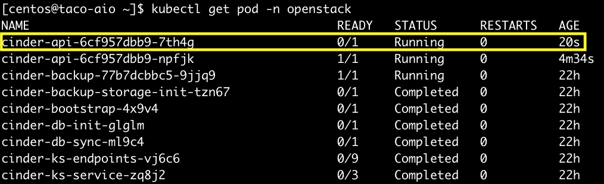

|
