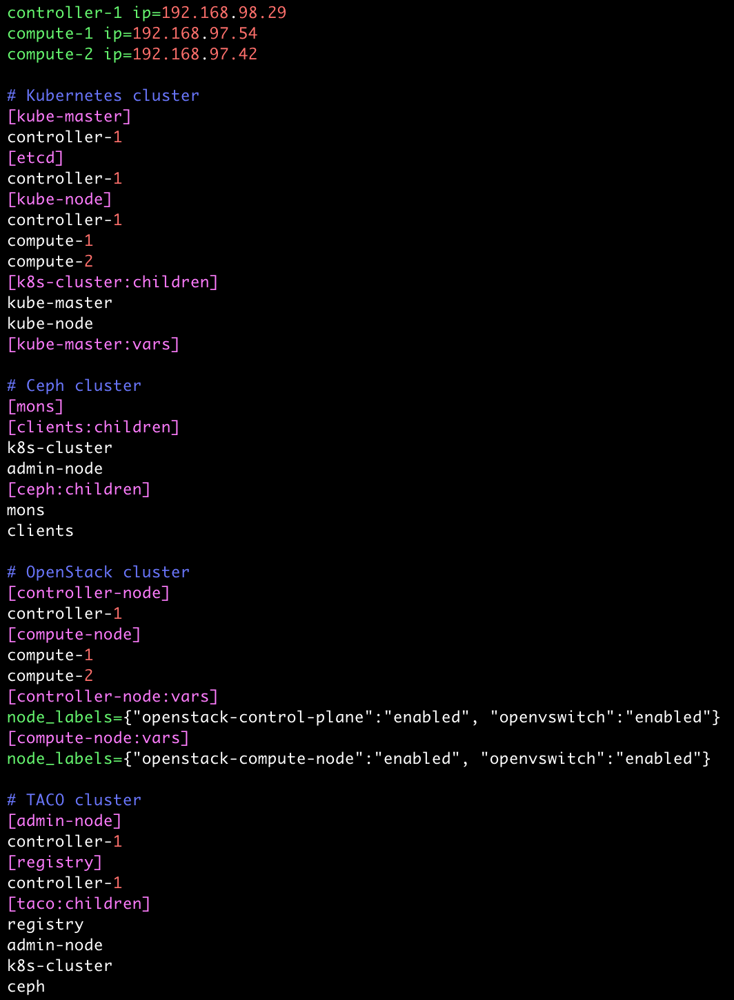
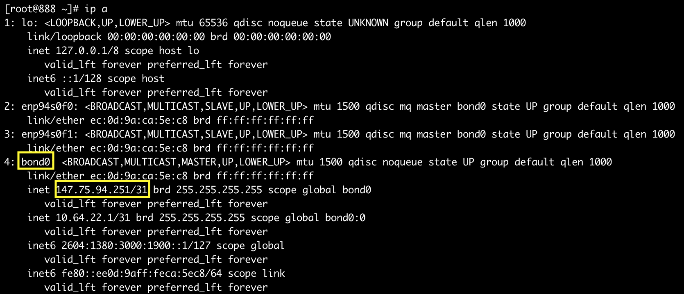
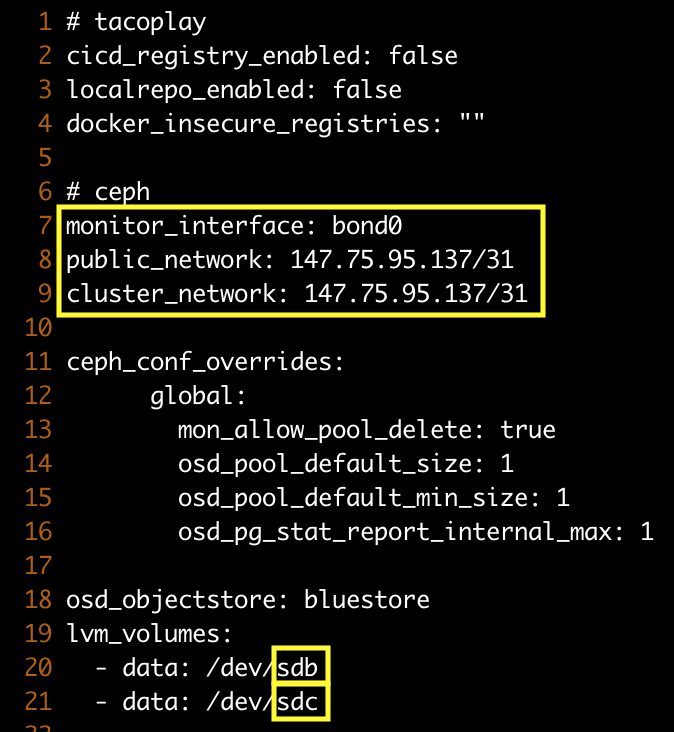

***********************
TACO install - aio node
***********************

tacoplay 설정
=============

* Tacoplay 받아서 준비하기

.. code-block:: bash

   $ sudo yum install -y git selinux-policy-targeted bridge-utils epel-release
   $ sudo yum install -y python-pip
   $ sudo pip install --upgrade pip==9.0.3
   $ git clone https://github.com/openinfradev/tacoplay.git
   $ cd tacoplay/
   $ ./scripts/prepare.sh ~/tacoplay/inventory/sample/armada-manifest.yaml
   

* 하위 프로젝트들 fetch

| - armada :  armada 설치에 필요한 소스
| - ceph-ansible : ceph 설치에 사용되는 ansible playbook
| - kubespray : kubernetes 설치에 사용되는 ansible playbook
| - charts : kubernetes위에 openstack을 배포하는 데 필요한 helm chart  

.. code-block:: bash

   $ ./fetch-sub-projects.sh
   

* ceph-ansible site.yml 생성

.. code-block:: bash

   $ cp ceph-ansible/site.yml.sample ceph-ansible/site.yml
   
* hosts.ini 파일 설명

| taco 클러스터를 구성하는 노드들을 역할에 맞게 정의한다.
| - kubespray : etcd / kube-master / kube-node / kube-cluster
| - ceph-ansible : mons / osds / mgrs / clients
| - openstack : controller-node / compute-node 
| - tacoplay : admin-node / registry / controller-node / compute-node
| 
| ex) 노드 3대를 사용할 때 

* extra-vars.yml 파일 설명 

ansible-playbook 실행 시 필요한 변수 값을 정의한다.
 
| - monitor_interface, public_network, cluster_network, lvm_molumes 확인 후 적절한 값으로 수정 

lsblk 명령어를 통해 ceph에서 사용할 수 있는 디스크를 확인한다. 

.. figure:: _static/lsblk2.png

ip a 명령어로 host의 ip주소를 확인한다.

lsblk와 ip a 명령어를 통해 확인한 값들로 extra-vars.yml 파일의 monitor_interface, public_network, cluster_network, lvm_molumes를 변경

.. code-block:: bash

   $ cd ~/tacoplay/inventory/sample
   $ vi extra-vars.yml

OS 설정
=======

* 호스트 파일 설정

.. code-block:: bash

   $ sudo vi /etc/hosts
   ## TACO ClusterInfo
   127.0.0.1   taco-aio
   

TACO 설치
=========

* TACO playbook 실행에 필요한 패키지 설치 

.. code-block:: bash

   cd ~/tacoplay
   sudo pip install -r ceph-ansible/requirements.txt
   sudo pip install -r kubespray/requirements.txt --upgrade
   sudo pip install -r requirements.txt --upgrade
   

* Taco 설치

.. code-block:: bash

   $ cd ~/tacoplay
   $ ansible-playbook -b -i inventory/sample/hosts.ini -e @inventory/sample/extra-vars.yml site.yml
   

| ansible-playbook 옵션 설명 
| -i : 사용할 inventory 파일 지정
| -e : 실행시간에 변수 값 전달

TACO 설치 확인
==============

* Network 설정

br-ex 인터페이스 up 시키고, nat 룰을 추가한다

.. code-block:: bash
   
   $ cd ~/tacoplay
   $ ./scripts/init-network.sh

* Openstack 설치 검증

.. code-block:: bash

   $ cd ~/tacoplay
   $ scripts/taco-test.sh
   

| 위의 script를 수행하면 다음과 같은 task들을 수행하여 Openstack이 정상 동작하는지 검증하게 된다.
| - (가상) Network 및 Router 생성
| - Cirros Image upload
| - SecurityGroup 생성
| - Keypair Import
| - VM 생성 후 floating IP 추가
| - Volume 생성 후 VM에 추가

VM 생성 후
==========

* 생성된 VM 확인하기

다음과 같은 명령어를 통해 taco-test 스크립트를 돌려 생성된 VM을 확인할 수 있다. 결과 Networks 란에서 생성된 VM 의 ip 주소를 확인한다.

.. code-block:: bash

   $ openstack server list
 
   > 결과
   +--------------------------------------+------+--------+------------------------------------+--------------+---------+
   | ID                                   | Name | Status | Networks                           | Image        | Flavor  |
   +--------------------------------------+------+--------+------------------------------------+--------------+---------+
   | 4dd41f3c-f230-4100-aaaf-3c58cc942463 | test | ACTIVE | private-net=172.30.1.7, 10.10.10.3 | Cirros-0.4.0 | m1.tiny |
   +--------------------------------------+------+--------+------------------------------------+--------------+---------+

* 생성된 VM에 접속, 외부 통신 확인

ssh로 VM 에 접속 후, 네트워크 접속 상태를 확인하기 위해 ping 테스트를 수행한다. ( 8.8.8.8 은 구글 퍼블릭 DNS ip주소)

.. code-block:: bash

   [root@taco-aio ~]# ssh cirros@10.10.10.3    #생성된 VM의 ip주소를 넣는다.
   $ ping 8.8.8.8
   PING 8.8.8.8 (8.8.8.8): 56 data bytes
   64 bytes from 8.8.8.8: seq=0 ttl=53 time=1.638 ms
   64 bytes from 8.8.8.8: seq=1 ttl=53 time=1.498 ms
   64 bytes from 8.8.8.8: seq=2 ttl=53 time=1.147 ms
   64 bytes from 8.8.8.8: seq=3 ttl=53 time=1.135 ms
   64 bytes from 8.8.8.8: seq=4 ttl=53 time=1.237 ms

Trouble Shoothing
=================

* Missing value auth-url required for auth plugin password

.. code-block:: bash

   $ . tacoplay/scripts/adminrc

